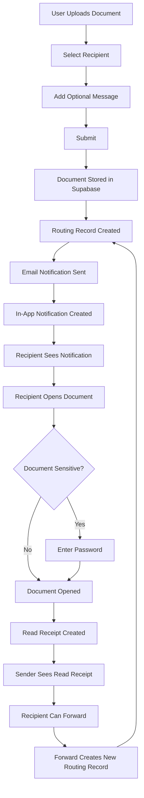
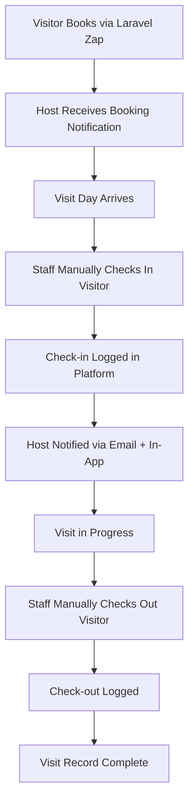
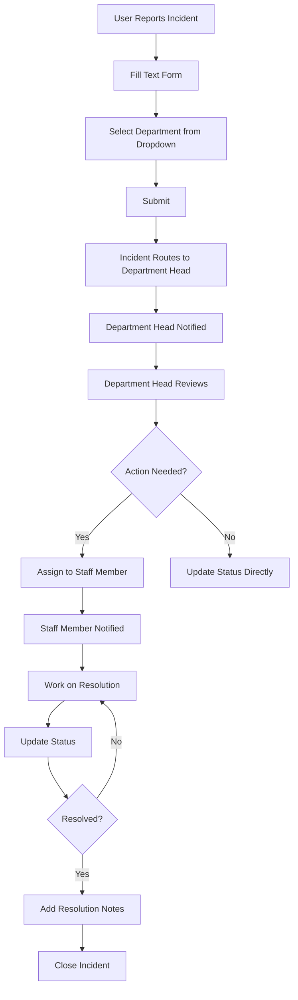
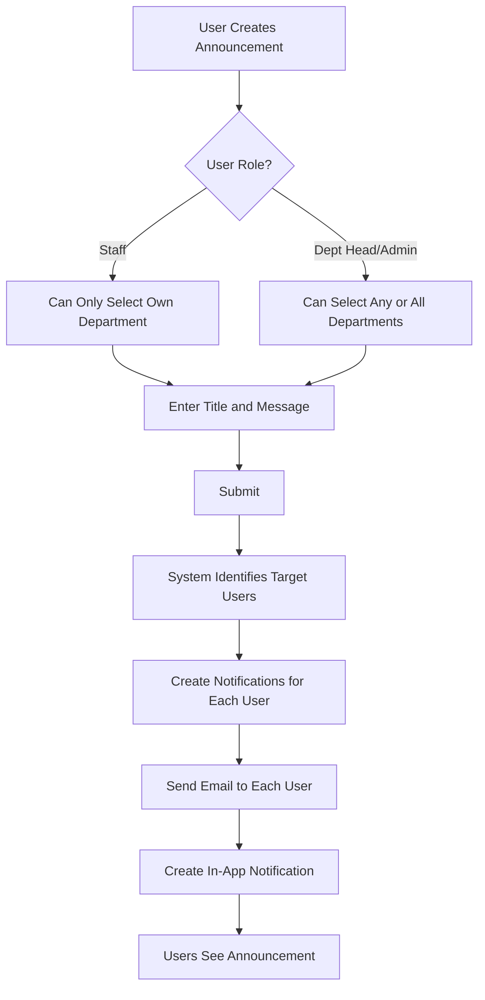
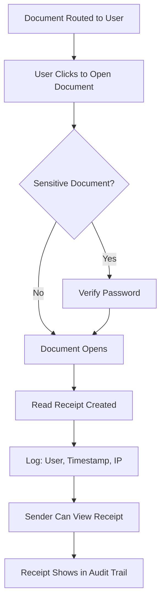

# Departmental Management Platform - Streamlined Project Scope

## 🎯 Project Overview

### The Problem

Modern organizations struggle with fragmented departmental workflows, particularly around document management, visitor coordination, and incident tracking. Current solutions often involve:

- Physical filing cabinets and paper-based document routing
- Manual visitor logbooks and phone-based coordination
- Email-only incident reporting with no tracking
- Disconnected systems that don't communicate
- Poor audit trails and accountability gaps

### The Solution

A streamlined digital platform that modernizes departmental operations with simple, practical workflows. The system replaces physical processes with straightforward digital alternatives while leveraging existing organizational infrastructure (email, authentication systems).

### Core Value Proposition

- **Digitizes** manual departmental processes with simple workflows
- **Centralizes** document routing, visitor management, and incident tracking
- **Integrates** with existing organizational infrastructure
- **Provides** clear audit trails and accountability
- **Scales** across multiple departments within an organization

---

## 🏢 Target Users & Use Cases

### Primary Users

1. **Department Staff** - Create, route, and manage documents and incidents
2. **Department Heads** - Manage team access, view department activity
3. **Administrative Staff** - Handle visitor management, cross-department coordination
4. **System Administrators** - Configure departments, users, and system settings
5. **Super Admin** - configures all,departments, users and everything else

### Key Use Cases - more may be added and most departments would have the same use cases for the app except stated otherwise

- **Library Department** just communication with staff and other departments), vendor communications, incident reports, dcoument storage, memos and letters
- **HR Department** managing employee documents, visitor appointments, workplace incidents
- **Finance Department** 
- **IT Department** managing incident reports
- **Administration , dept heads, admins and super admins**  broadcasting announcements and all others

---

## 🚀 Core Features & Modules

### 1. Document Management & Routing System

**Purpose**: Replace physical filing with simple digital document workflows

**Features**:

- Digital document upload and storage
- Simple A→B routing (send document to one person)
- Recipients can manually forward to others as needed
- Document search by title, category, and metadata
- Read receipts showing who opened documents and when
- Automatic audit trail tracking the full routing chain - using spactie activity logs package
- Password-protected access for sensitive documents
- Users can upload any document under categories and metadata

**Simplified Workflow**:

```
User A → User B
1. User A uploads document to platform
2. User A selects User B as recipient
3. System stores document and sends email notification to User B
4. User B receives in-app notification + email
5. User B opens document (password required if sensitive)
6. Read receipt logged: "User B opened at [timestamp]"
7. User B can forward to User C if needed
8. Full routing chain logged automatically
```


### 2. Visitor Management System

**Purpose**: Digitize visitor registration and track visit logs

**Features**:

- Laravel Zap integration for appointment scheduling
- Simple check-in/check-out logging
- Visitor history tracking (basic list/table view)
- Host notifications for visitor arrivals

**Simplified Workflow**:

```
External Visitor to IT Department
1. Visitor books appointment via Laravel Zap
2. IT staff receives booking notification
3. Day of visit: Manual check-in recorded in platform
4. Host notified of arrival via email + in-app
5. Manual check-out when visit ends
6. Visit logged with date, time, purpose, duration
```

### 3. Incident Reporting & Management

**Purpose**: Streamline incident documentation and departmental routing

**Features**:

- Text-based incident reporting (no file attachments)
- Department selection via dropdown
- Automatic routing to department head
- Incident status tracking
- Simple incident history view

**Incident Types**: - user would determine this in the incident report

- Security incidents (unauthorized access, theft)
- Maintenance issues (equipment failure, facility problems)
- Safety incidents (accidents, hazards)
- IT incidents (system outages, security concerns)
- Policy violations

**Simplified Workflow**:

```
Water Leak in Library
1. Staff reports incident via web form (text only)
2. Selects "Maintenance" department from dropdown
3. System automatically routes to Maintenance Department Head
4. Department head receives email + in-app notification
5. Department head assigns to staff member or responds
6. Status updated to "In Progress" → "Resolved"
7. Incident closed
```

### 4. Communication & Notification System

**Purpose**: Coordinate departmental communications and broadcasts

**Features**:

- Email + in-app notifications only
- Automated workflow notifications
- Department-wide announcements
- Broadcast to one department or all departments
- Document read receipts
- Notification history

**Announcement/Annoucement System**:

```
Creating Department Announcement
1. User creates announcement
2. Selects target: specific department OR all departments
3. Enters message (text + optional document link)
4. System sends email + in-app notification to all users in selected department(s)
5. Use cases: meetings, urgent alerts, policy updates
```

**Notification Types**:
- Document routed to you
- Document opened (read receipt)
- Visitor checked in
- Department announcements
- System alerts

**Key Simplifications**:
- Email + in-app notifications only (no push, no SMS)
- Simple announcement system (dropdown + message)

### 5. Read Receipts

**Purpose**: Track document access for accountability

**Features**:

- Automatic logging when documents are opened or downloaded
- Shows: User name, email, timestamp, IP address
- Visible to document sender only
- Simple list view of all opens
- Cannot be disabled by recipients

**Read Receipt Display**:

```
Document: "Q4 Budget Proposal"
Sent by: John Doe (Finance)
Sent to: Jane Smith (Administration)

Read Receipts:
- Jane Smith opened on Oct 3, 2025 at 2:45 PM
- Jane Smith forwarded to Mike Johnson
- Mike Johnson opened on Oct 3, 2025 at 4:12 PM
```

---

## 🏗️ Technical Architecture

### Tech Stack Selection

#### Backend Framework: Laravel 12, Inertia

#### Frontend: React + TypeScript

#### Database: PostgreSQL/Mysql -  which ever is best for the app

#### File Storage: Laravel file storage

#### Authentication: Laravel Built in Session-based

#### Visitor Check in & Out and User Schedules/Dept/ System Wide Scheduling: Laravel Zap with custom visitor check in and out system (symplified)

### System Architecture

```
┌─────────────────────────────────────────────────────────┐
│                    Client Layer                         │
├─────────────────────────────────────────────────────────┤
│  React Components (Inertia.js powered)                 │
│  • Document Viewer    • Visitor Logs                   │
│  • Incident Reporter  • Announcement Form              │
│  • Notification Bell  • Read Receipt Display           │
│  • Search Interface   • Simple Tables                  │
└─────────────────────────────────────────────────────────┘
                              │
┌─────────────────────────────────────────────────────────┐
│                  Application Layer                      │
├─────────────────────────────────────────────────────────┤
│  Laravel Controllers & Services                         │
│  • DocumentController     • VisitorController          │
│  • IncidentController     • AnnouncementController     │
│  • NotificationService    • MailService (SMTP)         │
│  • FileStorageService     • AuditService               │
│  • ReadReceiptService     • ZapSchedulingService       │
└─────────────────────────────────────────────────────────┘
                              │
┌─────────────────────────────────────────────────────────┐
│                   Data Layer                           │
├─────────────────────────────────────────────────────────┤
│  PostgreSQL Database                                    │
│  • Users & Departments    • Documents & Routing        │
│  • Visitors & Visits      • Incidents                  │
│  • Audit Logs            • Notifications               │
│  • Read Receipts         • Announcements               │
│                                                         │
│  Laravel file Storage                                       │
│  • Document Files        • User Uploads                │
│  • System Backups                                      │
└─────────────────────────────────────────────────────────┘
                              │
┌─────────────────────────────────────────────────────────┐
│                 Integration Layer                       │
├─────────────────────────────────────────────────────────┤
│  External Services                                      │
│  • SMTP Server (Google)  • Laravel Zap               │
│  • ILovePDF (external links to the website only)                      │
└─────────────────────────────────────────────────────────┘
```

---

## 🔐 Security & Authentication

### Authentication Strategy

- **Primary**: Session-based authentication
- **Document Access**: User password required for sensitive documents
- **Session Management**: Database-driven sessions with automatic timeout
- **Mobile Web**: Session persistence with secure cookies

### Email Integration

**SMTP Usage**:

- Used only for sending notification emails and emails to other users 
- Documents stored directly in laravel local file system
- Email contains notification + link to platform (not document attachment)

**SMTP Configuration** example:

```env
MAIL_MAILER=smtp
MAIL_HOST=smtp.office365.com
MAIL_PORT=587
MAIL_USERNAME=system@yourorg.com
MAIL_PASSWORD=app_specific_password
MAIL_ENCRYPTION=tls
```

### Data Protection

- **Encryption at Rest**: Database and file storage encryption
- **Encryption in Transit**: HTTPS/TLS for all communications
- **Access Control**: Role-based permissions with department visibility
- **Audit Logging**: Complete activity trails for compliance
- **Data Retention**: Configurable document and log retention policies
- **Read Receipts**: Track all document access with timestamps

---

## 👥 Role-Based Access Control (RBAC) - All Users can upload and store document in the types of pdf, doc, docx, etc including excel, powerpoints and images, texts, could even be audio or video files

### Role Hierarchy -  not all permissions have been added or maybe i should just use the super admin and drop admin, but i could add it if it is requested

#### NB - Department Heads can create users (apart from super admin and another department head role), roles are automatically assigned to the roles, SuperAdmin can create all users inclduing other admins and department heads. super admins, admins and dpt-heads can deactivate users but only admins and super admins can delete users

#### 1. Super Administrator

**Scope**: System-wide access  - basically, he has access to everything 
**Permissions**:

- Manage all departments and users
- System configuration and settings
- View all audit logs and read receipts
- Emergency access to all documents
- Backup and maintenance operations

#### 2. Department Head

**Scope**: Department-level access  
**Permissions**:

- Manage department staff and roles
- View all documents routed within department: only those addressed to him - other users need their privacy
- View department visitor logs
- Receive all incidents for their department
- View read receipts for department documents
- Send announcements to own or all departments

#### 3. Department Staff

**Scope**: Basic departmental operations  
**Permissions**:

- Upload and send documents to anyone
- View documents routed to them
- Forward received documents to others
- Check in/out visitors 
- Report incidents (select any department)
- Send announcements to own department or another (their own or more, if they are selected)
- View read receipts for documents they sent

### Simplified Permission Matrix

| Feature            | Super Admin   | Dept Head                                                                                                                                                 | Staff                                         |
| ------------------ | ------------- | --------------------------------------------------------------------------------------------------------------------------------------------------------- | --------------------------------------------- |
| Send Documents     | ✅ (anyone)    | ✅ (anyone)                                                                                                                                                | ✅ (anyone)                                    |
| View Documents     | ✅ (all)       | ✅ (routed to them)                                                                                                                                        | ✅ (routed to them)                            |
| View Read Receipts | ✅ (all)       | ✅ (dept docs routed to them)                                                                                                                              | ✅ (own docs)                                  |
| Manage Visitors    | ✅             | ✅ (dept)                                                                                                                                                  | ✅ (assigned)                                  |
| Create Incidents   | ✅             | ✅                                                                                                                                                         | ✅                                             |
| View Incidents     | ✅ (all)       | ✅ (dept only)                                                                                                                                             | ✅ (created by them)                           |
| Send Announcements | ✅ (all depts) | ✅ (all depts)                                                                                                                                             | ✅ (own dept)                                  |
| Manage Users       | ✅             | ✅ (dept)                                                                                                                                                  | ❌                                             |
| View Audit Logs    | ✅             | ✅ (dept but only some actions, because of users privacy they can only see their logs for documents, they can only those which have been routed to them  ) | ❌ but can view some of their own acivity logs |

### Cross-Department Permissions

- **Documents**: Anyone can send to anyone in any department
- **Incidents**: Anyone creates → selects department from dropdown → goes to that department head only
- **Announcements**: Staff can only broadcast to own department; Heads can broadcast to any/all departments
- **Visitors**: Visible only to host and their department

---

## 📊 Data Models & Relationships

### Core Entities

#### Users Table


```sql
users (
  id SERIAL PRIMARY KEY,
  email VARCHAR UNIQUE NOT NULL,
  password VARCHAR NOT NULL,
  first_name VARCHAR NOT NULL,
  last_name VARCHAR NOT NULL,
  phone VARCHAR,
  role user_role NOT NULL, -- 'super_admin', 'dept_head', 'staff'
  department_id INTEGER REFERENCES departments(id),
  is_active BOOLEAN DEFAULT true,
  last_login_at TIMESTAMP,
  email_verified_at TIMESTAMP,
  created_at TIMESTAMP DEFAULT NOW(),
  updated_at TIMESTAMP DEFAULT NOW(),
   email_notifications BOOLEAN DEFAULT true, -- master switch
  notification_settings JSONB DEFAULT '{
    "document_routed": {"email": true, "in_app": true},
    "document_opened": {"email": false, "in_app": true},
    "visitor_checked_in": {"email": true, "in_app": true},
    "incident_created": {"email": true, "in_app": true},
    "broadcast": {"email": true, "in_app": true}
  }'
)
```


## Implementation: User Notification Preferences

### System Behavior

1. **Broadcast notifications** always send email (override user preference) - they're important department-wide messages
2. **Other notifications** respect user settings
3. **In-app notifications** always created (can't be disabled) - users just won't get emails

---

## How "Announcements" Work Now

When a user creates a broadcast:

php

```php
// Create one notification per target user
$targetUsers = $this->getTargetUsers($broadcastScope, $departmentId);

foreach ($targetUsers as $user) {
    Notification::create([
        'user_id' => $user->id,
        'created_by' => auth()->id(),
        'title' => $request->title,
        'message' => $request->message,
        'type' => 'broadcast',
        'is_broadcast' => true,
        'broadcast_scope' => $broadcastScope, // 'department' or 'all_departments'
        'broadcast_department_id' => $departmentId,
        'sent_via' => 'both', // Always email + in-app for broadcasts
    ]);
    
    // Send email
    Mail::to($user->email)->send(new BroadcastNotification($notification));
}
```

### Querying "Announcements"

php

```php
// All broadcasts sent by me
Notification::where('created_by', auth()->id())
    ->where('is_broadcast', true)
    ->groupBy('created_at', 'title') // Group duplicates
    ->get();

// All broadcasts I received
Notification::where('user_id', auth()->id())
    ->where('is_broadcast', true)
    ->get();
```

#### Departments Table

```sql
departments (
  id SERIAL PRIMARY KEY,
  name VARCHAR NOT NULL,
  description TEXT,
  code VARCHAR(10) UNIQUE, -- e.g., 'LIB', 'HR', 'IT'
  head_user_id INTEGER REFERENCES users(id),
  is_active BOOLEAN DEFAULT true,
  created_at TIMESTAMP DEFAULT NOW(),
  updated_at TIMESTAMP DEFAULT NOW()
)
```

#### Documents Table

```sql
documents (
  id SERIAL PRIMARY KEY,
  title VARCHAR NOT NULL,
  description TEXT,
  file_path VARCHAR NOT NULL, -- laravel file storage path
  file_size INTEGER,
  file_type VARCHAR, -- 'pdf', 'docx', 'xlsx', 'pptx', 'jpg', etc.
  status VARCHAR DEFAULT 'active', -- 'active', 'archived', 'deleted'
  document_category VARCHAR NOT NULL, -- 'letter', 'report', 'analysis', 'notice', 'memo', 'policy', 'code', 'meeting_minutes', 'invoice', 'other'
  created_by INTEGER REFERENCES users(id),
  department_id INTEGER REFERENCES departments(id),
  is_sensitive BOOLEAN DEFAULT false,
  metadata JSONB, -- flexible document properties (fiscal_year, project_code, confidentiality_level, etc.)
  created_at TIMESTAMP DEFAULT NOW(),
  updated_at TIMESTAMP DEFAULT NOW()
  
  -- Documents search 
CREATE INDEX idx_documents_title_search ON documents USING gin(to_tsvector('english', title)); CREATE INDEX idx_documents_category ON documents(document_category); CREATE INDEX idx_documents_department ON documents(department_id);
)
```

### 1. **Document Categories Dropdown** (when uploading)

- Letter
- Report
- Analysis
- Notice
- Memo
- Policy Document
- Code/Technical Doc
- Meeting Minutes
- Invoice/Financial
- Other

### 2. **Search/Filter by Category**

- "Show me all reports from HR department"
- "Find all notices sent in October"
- Department heads can filter their document library by type

### 3. **Category-Based Permissions** (optional enhancement)

- Some document types might have different routing rules
- E.g., "Policy Documents" always require department head approval
#### Document Routing Table

```sql
document_routing (
  id SERIAL PRIMARY KEY,
  document_id INTEGER REFERENCES documents(id),
  from_user_id INTEGER REFERENCES users(id),
  to_user_id INTEGER REFERENCES users(id),
  message TEXT, -- routing note
  status routing_status DEFAULT 'sent', -- 'sent', 'opened', 'forwarded'
  created_at TIMESTAMP DEFAULT NOW()
)

-- Routing lookups 
CREATE INDEX idx_routing_to_user ON document_routing(to_user_id); CREATE INDEX idx_routing_document ON document_routing(document_id);
```

#### Read Receipts Table

```sql
read_receipts (
  id SERIAL PRIMARY KEY,
  document_id INTEGER REFERENCES documents(id),
  routing_id INTEGER REFERENCES document_routing(id),
  user_id INTEGER REFERENCES users(id),
  opened_at TIMESTAMP NOT NULL,
  ip_address INET,
  user_agent TEXT,
  created_at TIMESTAMP DEFAULT NOW()
)
```

## 1. **Merge Visitors + Visitor_Visits Tables**


```sql
visitor_visits (
  id SERIAL PRIMARY KEY,
  -- Visitor info (inline)
  visitor_first_name VARCHAR NOT NULL,
  visitor_last_name VARCHAR NOT NULL,
  visitor_email VARCHAR,
  visitor_phone VARCHAR,
  visitor_company VARCHAR,
  
  -- Visit details
  host_user_id INTEGER REFERENCES users(id),
  department_id INTEGER REFERENCES departments(id),
  purpose TEXT NOT NULL,
  visit_date DATE NOT NULL,
  check_in_time TIMESTAMP,
  check_out_time TIMESTAMP,
  notes TEXT,
  zap_booking_id VARCHAR,
  created_at TIMESTAMP DEFAULT NOW(),
  updated_at TIMESTAMP DEFAULT NOW()
)
```

#### Incidents Table

```sql
incidents (
  id SERIAL PRIMARY KEY,
  title VARCHAR NOT NULL,
  description TEXT NOT NULL,
  incident_type incident_type NOT NULL, -- 'security', 'maintenance', 'safety', 'it', 'policy'
  location VARCHAR,
  reported_by INTEGER REFERENCES users(id),
  assigned_department_id INTEGER REFERENCES departments(id), -- selected via dropdown
  assigned_to INTEGER REFERENCES users(id), -- department head assigns
  status incident_status DEFAULT 'open', -- 'open', 'in_progress', 'resolved', 'closed'
  resolved_at TIMESTAMP,
  resolution_notes TEXT,
  created_at TIMESTAMP DEFAULT NOW(),
  updated_at TIMESTAMP DEFAULT NOW()
  
  CREATE INDEX idx_incidents_department_status ON incidents(assigned_department_id, status);
)
```

#### Audit Logs - to use spactie activity logs package
## Notification Strategy (Streamlined)

You already merged announcements into notifications—**keep only the `notifications` table**. Here's the final structure:

### Updated Notifications Table

sql

```sql
notifications (
  id SERIAL PRIMARY KEY,
  user_id INTEGER REFERENCES users(id), -- recipient
  created_by INTEGER REFERENCES users(id), -- sender (NULL for system notifications)
  
  title VARCHAR NOT NULL,
  message TEXT,
  
  type VARCHAR NOT NULL, -- 'document_routed', 'document_opened', 'visitor_checked_in', 'incident_created', 'broadcast', 'system'
  
  -- Broadcast fields (only used when type='broadcast')
  is_broadcast BOOLEAN DEFAULT false,
  broadcast_scope VARCHAR, -- 'department', 'all_departments' (NULL if not broadcast)
  broadcast_department_id INTEGER REFERENCES departments(id), -- NULL if all_departments
  
  -- Related record tracking
  related_model VARCHAR, -- 'Document', 'Incident', 'VisitorVisit'
  related_id INTEGER,
  
  -- Notification delivery
  sent_via VARCHAR DEFAULT 'in_app', -- 'in_app', 'email', 'both'
  email_sent_at TIMESTAMP,
  
  read_at TIMESTAMP,
  created_at TIMESTAMP DEFAULT NOW()
)
```

### Smart Email Rules (Auto-Determined)

```
Notification Type              → Email?   In-App?
─────────────────────────────────────────────────
Document routed to you         → Yes      Yes
Document opened (read receipt) → No       Yes
Visitor checked in             → No      Yes
Incident created               → Yes      Yes
Broadcast (your dept)          → Yes      Yes
Broadcast (all depts)          → Yes      Yes
System alerts                  → Yes      Yes
```

**Logic:** Email for anything that requires action or awareness beyond the current user. In-app for everything.
### Relationship Diagram

```
Users ──┐
        ├── Documents (created_by)
        ├── Document_Routing (from/to user)
        ├── Read_Receipts (user_id)
        ├── Visitor_Visits (host_user)
        ├── Incidents (reported_by, assigned_to)
        ├── Announcements (created_by)
        └── Audit_Logs (user_id)

Departments ──┐
             ├── Users (department_id)
             ├── Documents (department_id)
             ├── Visitor_Visits (department_id)
             ├── Incidents (assigned_department_id)
             └── Announcements (target_department_id)

Documents ──┐
           ├── Document_Routing (document_id)
           └── Read_Receipts (document_id)

Visitors ────── Visitor_Visits (visitor_id)

Document_Routing ────── Read_Receipts (routing_id)
```

---

## 🔄 Key System Flows

### 1. Simple Document Routing Flow



### 2. Visitor Management Flow



### 3. Incident Reporting Flow



### 4. Announcement Broadcast Flow



### 5. Read Receipt Tracking Flow



---

## 📈 Development Phases & Timeline

### Phase 1: Foundation

**Deliverables**:

- Database schema implementation
- User authentication system
- Basic RBAC framework
- Core Laravel + Inertia.js setup

**Key Tasks**:

- PostgreSQL database setup with migrations
- User registration/login with session management
- Department and role management
- Basic React component structure

### Phase 2: Document Management

**Deliverables**:

- Document upload and storage system
- Simple A→B routing
- Read receipts tracking
- Document viewer

**Key Tasks**:

- laravel file storage integration
- Document CRUD operations
- Simple routing (select user, send)
- Read receipt logging and display
- Password-protected document access

### Phase 3: Visitor Management

**Deliverables**:

- Laravel Zap integration
- Check-in/check-out logging
- Basic visitor history view

**Key Tasks**:

- Laravel Zap setup for appointments
- Simple visitor list/table views
- Host notification system

### Phase 4: Incident Management

**Deliverables**:

- Text-only incident reporting
- Department dropdown routing
- Simple incident tracking

**Key Tasks**:

- Incident form creation
- Department selection dropdown
- Automatic routing to department head
- Basic status tracking

### Phase 5: Announcements & Notifications

**Deliverables**:

- Department announcement system
- Email + in-app notifications
- Notification history

**Key Tasks**:

- Announcement broadcast system
- Target department selection (one or all)
- Email notification integration
- In-app notification bell/panel

### Phase 6: Search & Audit 

**Deliverables**:

- Document search by title/description/metadata
- Complete audit trail
- Read receipt reports

**Key Tasks**:

- PostgreSQL full-text search
- Audit log display
- Read receipt summary views
- Activity reports

### Phase 7: Testing & Deployment

**Deliverables**:

- Comprehensive test suite
- Production deployment
- User documentation
- Training materials

**Key Tasks**:

- Unit and integration testing
- Mobile-responsive testing
- Security testing
- Production environment setup
- User training and documentation

---

#### External Service Configuration

```env
# Laravel Zap Configuration
ZAP_API_KEY=your_zap_key
ZAP_CALENDAR_ID=your_calendar_id

# Queue Configuration
QUEUE_CONNECTION=redis
REDIS_HOST=127.0.0.1
REDIS_PASSWORD=null
REDIS_PORT=6379
```
## Further integration

**Analytics Dashboard** -  more to be added

- Document routing visualization
- Incident trend analysis
- Department activity comparison
- Read receipt analytics


**Audit logs** -  more to be added

- user infinite scroll from inertia to show user activity logs

---

### Intangible Benefits

- **Improved Accountability**: Read receipts provide proof of document delivery and viewing
- **Enhanced Security**: Better document control and access tracking
- **Staff Satisfaction**: Reduced manual work and clearer communication
- **Environmental Impact**: Significant reduction in paper usage
- **Scalability**: Platform grows with organizational needs

---

#### Queue System

- **Jobs**: Background processing for emails and notifications
- **Laravel Nightwatch**: Dashboard for monitoring Redis queues
- **Job Chains**: For sequential notification delivery
- **Failed Job Handling**: Automatic retry and failure notification

#### Storage & File Management

- **Laravel Storage**: Facade for file operations
- **Custom Filesystem**: Integration with Supabase Storage (later version)

#### Events & Listeners

- **Event System**: For decoupled notification and logging
- **Custom Events**: 
  - DocumentRouted
  - DocumentOpened (triggers read receipt)
  - IncidentCreated
  - VisitorCheckedIn
  - AnnouncementBroadcast
- **Listeners**: 
  - SendEmailNotification
  - CreateInAppNotification
  - LogAuditTrail
  - CreateReadReceipt

#### Useful Packages

```bash
# Essential Laravel Packages
composer require spatie/laravel-permission # Role and permission management
composer require spatie/laravel-activitylog # Audit logging
composer require barryvdh/laravel-dompdf # PDF generation for reports
composer require laravel-zap/laravel-zap # Visitor and users scheduling

# Development Packages
composer require laravel/nightwatch --dev # Debugging assistant
composer require laravel/horizon # Queue monitoring
```

#### Simple Document Routing

```php
// Store document and route to user
public function route(Request $request, Document $document)
{
    $validated = $request->validate([
        'to_user_id' => 'required|exists:users,id',
        'message' => 'nullable|string|max:500',
    ]);

    $routing = DocumentRouting::create([
        'document_id' => $document->id,
        'from_user_id' => auth()->id(),
        'to_user_id' => $validated['to_user_id'],
        'message' => $validated['message'],
        'status' => 'sent',
    ]);

    // Trigger notifications
    event(new DocumentRouted($routing));
    
    return redirect()->back()->with('success', 'Document sent successfully.');
}
```

#### Read Receipt Tracking

```php
// DocumentController.php
public function show(Document $document)
{
    // Check if user has access
    $this->authorize('view', $document);
    
    // If sensitive, require password
    if ($document->is_sensitive && !session('document_authenticated_' . $document->id)) {
        return Inertia::render('Documents/Authenticate', [
            'document' => $document,
        ]);
    }
    
    // Create read receipt
    ReadReceipt::create([
        'document_id' => $document->id,
        'user_id' => auth()->id(),
        'opened_at' => now(),
        'ip_address' => request()->ip(),
        'user_agent' => request()->userAgent(),
    ]);
    
    // Log audit trail
    AuditLog::create([
        'user_id' => auth()->id(),
        'model_name' => 'Document',
        'record_id' => $document->id,
        'action' => 'view',
        'description' => 'Opened document: ' . $document->title,
        'ip_address' => request()->ip(),
    ]);
    
    return Inertia::render('Documents/Show', [
        'document' => $document->load(['creator', 'readReceipts.user']),
    ]);
}
```

#### Announcement Broadcasting

```php
// AnnouncementController.php
public function store(Request $request)
{
    $validated = $request->validate([
        'title' => 'required|string|max:255',
        'message' => 'required|string',
        'target_type' => 'required|in:department,all_departments',
        'target_department_id' => 'required_if:target_type,department|exists:departments,id',
    ]);
    
    // Check permissions
    if ($validated['target_type'] === 'all_departments' && !auth()->user()->canBroadcastToAll()) {
        abort(403, 'You can only broadcast to your own department.');
    }
    
    $announcement = Announcement::create([
        'title' => $validated['title'],
        'message' => $validated['message'],
        'created_by' => auth()->id(),
        'target_type' => $validated['target_type'],
        'target_department_id' => $validated['target_department_id'] ?? null,
    ]);
    
    // Trigger broadcast event
    event(new AnnouncementBroadcast($announcement));
    
    return redirect()->back()->with('success', 'Announcement sent successfully.');
}
```

#### Shared Data Pattern

```php
// HandleInertiaRequests middleware
public function share(Request $request): array
{
    return array_merge(parent::share($request), [
        'auth' => [
            'user' => $request->user() ? [
                'id' => $request->user()->id,
                'name' => $request->user()->name,
                'email' => $request->user()->email,
                'role' => $request->user()->role,
                'department' => $request->user()->department,
            ] : null,
        ],
        'flash' => [
            'success' => fn () => $request->session()->get('success'),
            'error' => fn () => $request->session()->get('error'),
        ],
        'unreadNotifications' => $request->user() 
            ? $request->user()->unreadNotifications()->count()
            : 0,
    ]);
}
```

---


## Final Schema Summary

**Tables you have:**

1. ✅ users
2. ✅ departments
3. ✅ documents (with `status` and `document_category`)
4. ✅ document_routing
5. ✅ read_receipts
6. ✅ visitor_visits (merged from 2 tables)
7. ✅ incidents (no severity)
8. ✅ notifications (handles broadcasts + regular notifications)

**Tables you DON'T have:**

- ❌ announcements (merged into notifications)
- ❌ visitors (merged into visitor_visits)
- ❌ audit_logs (using Spatie package instead)

## 📱 Mobile-Responsive Design

### Design Principles

- **Mobile-First Approach**: Design for mobile screens, scale up to desktop
- **Touch-Friendly**: Large buttons and tap targets (minimum 44x44px)
- **Responsive Tables**: Stack columns on mobile, full table on desktop
- **Fast Loading**: Optimized images and lazy loading

### Responsive Breakpoints

```css
/* Mobile: 0-640px */
/* Tablet: 641-1024px */
/* Desktop: 1025px+ */
```

---

## 🔒 Security Practices

### Authentication Security

- **Session Timeout**: 45 minutes of inactivity
- **Failed Login Protection**: Lock account after 5 failed attempts
- **Sensitive Document Access**: Require password re-entry

### Data Security

- **Encryption at Rest**: All documents encrypted in file storage
- **Encryption in Transit**: HTTPS/TLS for all connections
- **SQL Injection Prevention**: Eloquent ORM parameterized queries
- **XSS Prevention**: React automatic escaping + Laravel CSRF tokens
- **File Upload Validation**: File type and size restrictions - max size should be 50 MB

### Audit & Compliance

- **Complete Audit Trail**: All actions logged with user, timestamp, IP, email
- **Read Receipt Tracking**: Proof of document delivery and viewing
- **Data Retention**: Configurable retention policies
- **GDPR Compliance**: User data export and deletion capabilities
- **Regular Backups**: Automated daily backups with 30-day retention

---

## 🎨 User Interface Guidelines

### Design System - to be changed

- **Color Palette**: 
  - Primary: Blue (#3B82F6)
  - Secondary: Gray (#6B7280)
  - Success: Green (#10B981)
  - Warning: Yellow (#F59E0B)
  - Error: Red (#EF4444)

- **Typography**: 
  - Headings: Inter or System Font
  - Body: System Font Stack for performance

### Key User Flows

1. **Send Document**: Upload → Select recipient → Add message → Send
2. **Check-in Visitor**: Search visitor → Select → Enter purpose → Check-in
3. **Report Incident**: Select type → Enter details → Select department → Submit
4. **Broadcast Announcement**: Select target → Enter message → Send

This platform is positioned to become an essential, easy-to-use tool for modern organizational operations—delivering the digital infrastructure needed for efficient, secure, and accountable departmental management without unnecessary complexity.
